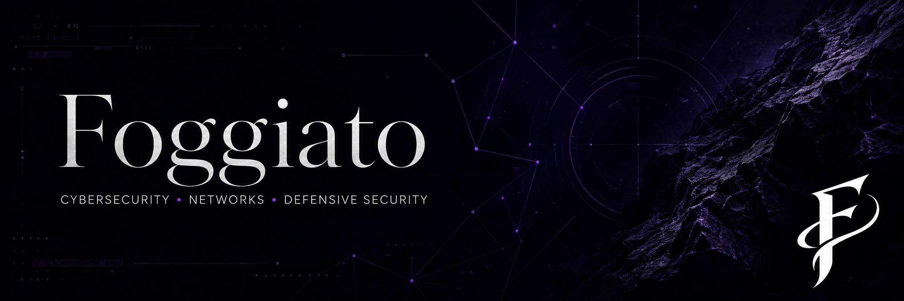

<p align="center">
  
</p>

<div align="center">

# Foggiato


<br/>

`inaparente`

</div>

---

## About

Cybersecurity student focused on defensive security, networking, Linux, IAM and SOC fundamentals.

Currently building a technical foundation through study notes, labs and documented practice.

Not trying to look dangerous.
Just learning how systems work.

---

## Current focus

```txt
Networks
Linux
Windows logs
IAM
SOC fundamentals
Defensive security
Technical documentation
```

---

## Learning path

```txt
Networks → Linux → Windows → Logs → IAM → SOC → Cloud Security
```

---

## Study journal

This profile is being built as a public learning journal.

The goal is simple:

```txt
study → practice → document → improve
```

Current phase:

```txt
Introduction to Cybersecurity
Networking fundamentals
Basic system concepts
Security awareness
```

---

## Tools & topics

<div align="left">


</div>
---

## Repositories in progress

```txt
cybersecurity-learning-journal
└── study notes, labs and learning roadmap

networking-notes
└── networking fundamentals and practical commands

soc-labs
└── defensive security labs and incident analysis
```

---

<div align="center">

```txt
quiet profile. loud progress.

