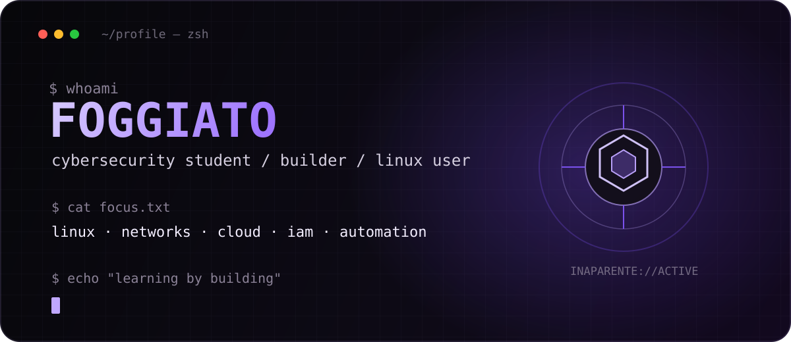

<p align="center">
  
</p>

<div align="center">

### learning systems by taking them apart, building them back, and asking too many questions.

`cybersecurity` · `linux` · `networks` · `cloud` · `iam` · `automation`

</div>

---

## `> about_me`

I'm **Foggiato**, a cybersecurity student currently building a real technical foundation around **Linux, networking, cloud and Identity & Access Management**.

I'm not here to pretend I already know everything in this profile. Most of what you see here represents something I'm **studying, testing, breaking, documenting or actively trying to understand better**.

I learn best by turning ideas into actual projects — especially when they involve systems, automation, APIs, AI or something that probably did not need to become a project in the first place.

```bash
$ philosophy
learn → build → break → understand → repeat
```

---

<table>
<tr>
<td width="50%" valign="top">

### `> current_focus`

```txt
Linux & system fundamentals
Networking
Cloud foundations
IAM
Defensive security
Security tooling
Technical English
```

</td>
<td width="50%" valign="top">

### `> things_i_build`

```txt
Local automation
AI integrations
API experiments
Linux tooling
Small utilities
Interfaces with personality
Security study projects
```

</td>
</tr>
</table>

---

## `> active_project`

### JARVIS BRIDGE

A personal project where I experiment with **voice interaction, local automation, APIs, AI, system integration and human-computer interaction**.

It started as a simple idea and naturally became the kind of project where one feature creates three more problems to solve.

```txt
voice
  └─ recognition
      └─ intent
          └─ automation
              └─ system actions
                  └─ "okay, now what if..."
```

---

## `> stack_and_tools`

<div align="center">


<br/>


</div>

<sub>These are technologies and areas I'm currently using, studying or exploring — not a claim of mastery.</sub>

---

## `> learning_path`

```txt
systems
├── linux
├── networking
├── windows
└── scripting

security
├── defensive fundamentals
├── logs & monitoring
├── iam
└── soc concepts

next
└── cloud security
```

---

## `> outside_the_terminal`

I'm also into **digital aesthetics, visual identity, Marvel, anime, music and geek culture**.

That usually leaks into the things I build. I like projects that work, but I also care about how they **feel, look and communicate personality**.

---

<div align="center">

```txt
INAPARENTE://ONLINE

curiosity > credentials
progress > pretending
```

<sub>quiet profile. loud progress.</sub>

</div>
