<div align="center">

# FOGGIATO

### `systems · security · automation`

<sub>`lang:` [EN](./README.md) · **PT-BR**</sub>



`fogg@github:~$ whoami`

</div>


## `01 // sobre`

Salve, eu sou o **Pedro Foggiato**, bem-vindo(a) ao meu perfil!

Estou construindo, aos poucos, minha base de conhecimento em DevSecOps: Linux, redes, cloud, IAM, AWS, segurança defensiva e entendimento de como ataques realmente funcionam. Gosto de ir a fundo pra entender um problema ou sistema, é isso que me ensina a usá-lo e a defendê-lo. Essa curiosidade já me ferrou algumas vezes, mas segue o jogo:

De cada lab, script ou experimento eu costumo sair documentando, geralmente porque me perguntei "beleza, mas será que eu consigo fazer isso funcionar de verdade?"

Isso aqui, por enquanto, está longe de ser uma lista de tecnologias que eu domino. É mais um diário do que estou **aprendendo, testando e, aos poucos, ACERTANDO**. Errar também é bem notório por aqui, rs.




## `02 // foco_atual`

```bash
$ cat focus.txt

linux
networking
identity_and_access_management
cloud
defensive_security
automation
ai_integrations
```

Ultimamente tenho puxado mais para **IAM e Cloud Security**, mas nada disso se sustenta sem uma base sólida em sistemas e redes. É ali que boa parte do trabalho do dia a dia ainda acontece.


## `03 // como_aprendo`

Teoria sozinha não gruda em mim, preciso de um lugar para colocar esse conhecimento na massa.

```text
entender → testar → quebrar algo → descobrir o porquê
       → reconstruir direito → documentar o que importou
```

Dá uma olhada nos meus repositórios: você vai ver esse loop se repetindo, com certeza.


## `04 // o_que_construo`

Meus projetos costumam viver na sobreposição entre:

```text
security · linux · automation · APIs · AI · interfaces · infrastructure
```

O que realmente me prende é fazer peças diferentes conversarem de forma confiável, não mais uma demo isolada que só roda na minha máquina.


## `05 // jarvis_bridge`

Um desses experimentos virou o **Jarvis Bridge**.

Começou como um "deixa eu tentar construir um assistente de voz local" e foi silenciosamente virando um playground de interação por voz, automação local, APIs, integrações de IA, comportamento de sistema, tratamento de eventos e confiabilidade, basicamente todo jeito possível de um humano e uma máquina se entenderem mal.

Não finjo que construí o JARVIS do Homem de Ferro. A parte interessante é tudo que eu tive que aprender só de tentar.


## `06 // atualmente`

```yaml
status: building
primary_environment: Linux
security_direction:
  - IAM
  - Cloud Security
  - Defensive Security
improving:
  - Networking
  - Python
  - System Administration
  - English
approach: aprender → testar → documentar → repetir
```


## `07 // stack_em_progresso`

<div align="center">


</div>

<sub>Coisas com as quais estou trabalhando ou estudando ativamente agora, não uma coleção de selinhos.</sub>


## `08 // fora_do_terminal`

Tecnologia consome a maior parte da minha tela. O que sobra vai geralmente para **estética digital, identidade visual, música, Marvel, animes e qualquer ideia aleatória que pareça valer a pena virar projeto**.

O que provavelmente explica por que até meus projetos técnicos raramente ficam puramente funcionais: não resisto e sempre acabo caprichando na aparência.


<div align="center">

### `quer saber o que eu realmente sei?`

**Não confie só na minha palavra.**

Olha os repositórios. Lê os commits. Essa é a bio de verdade.

<br/>



</div>
